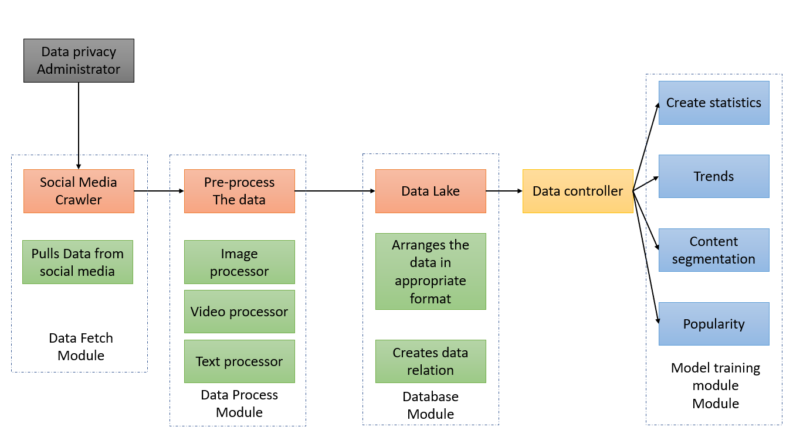

# Problem 1 Social Media Agent

## Problem Elaboration

- In social media there are types of contents which includes various types of data. These includes texts, images, videos and some numerical data like number of reactions to a post, number people in a person's profile etc.

- These data are not the same types meaning their processing will be of different types.

- Some outputs will not require all kinds of data to get the required output. Meaning we need to decide which data we need to what features.

## Solution Approch for this Problem

- I have created my approach to solve this problem in the given diagram 

- I have the divided the whole task into 5 modules

### Social Media Crawler module

- This module will gather information from social medias. 
- Now-a-days data privacy is very important for users. I have defined data privacy administrator which will monitar what data to collect from the sites
- After collecting the data this module send all the data raw data to the Data process module

### Data process module

- This will first cateforize the data based on its type
- There will be sub module each type of data. 
- Each module will process the data based on its parameters
- Image data will be processed by image processor 
- One things is very important is keep the relation between each data even after processing. Like which are comments for which post which may contain images or video
- These relation and processed data will be sent to database module

### Database module

- These module store the data and create meaningful relation between each data so that data storage can be optimized 
- For this module we may need database or some big data storage module like hadoop. 

### Data controller module

- This is basically an api segment which will fetch data from the data lake based on the query
- This module will form the dataset for model training 

### Model Training module

- There will different sub module for each output we want. 
- Because we may not all features for each feature. An example is that if we want to see which type of conten is popular in a region. We need to the statistics of contents in that region and reactions to these contens. We do not need what are reaction types in that reaction.
- For each feature there will be a set queries which will form the dataset for each feature using the data controller module. 
- Each module will have their model defined. Using the api we can train each module differently. 
- We can also establish inter-connectivity between if for some feature may require output from other module.

**I believe this architecture will support microservice concepts so that each module can be maintained and updated very easily.**