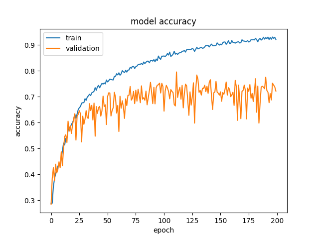
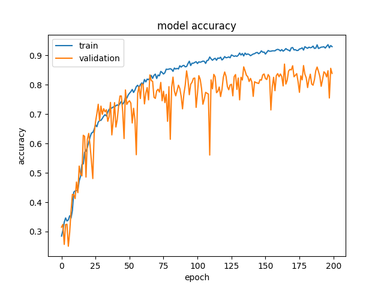

# **Problem 2 Submission Description**

## Folder's Description

- Dataset

Inside this folder the extracted data is kept. I have removed some unnecessary files that were inside the zip file. This folder contains two folders. *Train* and *Test* under which the there four classes of images within the sub-folders

- checkpoints

Inside this folder the best models during training will be saved.

There are some model which couldn't be uploaded due to a big size.
The model can be downloaded from following
[link](https://drive.google.com/drive/folders/11tJWrn3ENzx9nTViyd1UHOiC0EAQtOhU?usp=share_link).

- models

Inside this folder the model from last epoch will be saved.
- logs

Inside this folder the logs for tensorboard logs are kept. Also this folder contains training and validation accuracy comparison figure plotted by matplotlib.

## File's Description

- data_preprocess.py

This file contains the functions to preprocess the images so that these images can be used for training. *generata_train_data()* functions reshapes the image, converts the image list to np.array and assings label to each image. *process_test_data()* also does the same things as previous function. 

**For this task I have used the test data for validation**

- test_data_properties.py

This piece is to test whether all the images are of the same size and other temporary tasks for various resaons.

- train_model.py

This file contains the function to train the model using the *train_model()* function. There are three different training mode I have created for this task. 

### resnet 
One of the training mode is resnet which is a very popular model now-a-days for vision related task. Chossing the resnet mode will create a classification model with four output classes with resnet50 architecture. 

### efficientnet
Second training mode is efficienet which is faster and better performing model in some cases for vision related tasks. Chossing the efficientnet mode will create a classification model with four output classes using efficientnetB0 architecture. 

### ensemble 
This mode will use train the previosuly described model. Then it will take best models from training and then using average method will create save another model to the specified location.

**I have added a image augmentation layer to both of the models**

- single_image_inference.py

This file will generate prediction result using a specified image and a specified model using the *get_prediction()* function.

- config.py

This file is created so that changing parameters from this file only we can train and generate inference from the models. You can select training mode, batch size and epoch for training and model path, image path for inference. 

Also if you want use to pre_trained model that can be set from here too.

- classification.yml

In this file required libraries are defined for this pipepline create environment using this file

## Overfitting issue

In this perticular dataset the data are very robust and very different from one another, even inside the same class. 

Inside the class bird, there is not only one or two types to bird, there are many types of bird and the images are taken are from various angle and distance. Some images are taken from very close distance. Also some images have very high backfround features. Thus it even inside the same class the features are very hard to generalize. 

There are some outliers too, inside the bird class there is a image which contains the feature of peacock. These images have to handled differently and have to done few preprocessing so that performances of the model can be improved. 

I have plotted the accuracy comparison inside the logs folder for both the model. Which does suggest a bit of overfitting model but processing the data as described above will resolve the overfitting issue. 

I have two models in this task. First one is resnet. Accuracy metrices for this is given below. 

But the efficient model performed better.

 

There is some some level of overfitting but this can be resolved carefully chosing the validation data. 